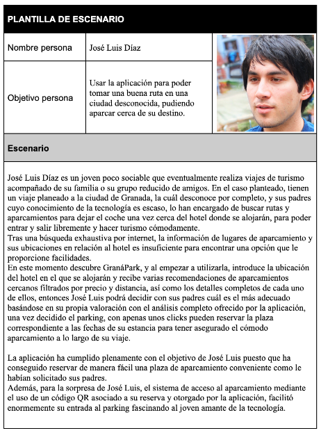

# GranaPark
https://sites.google.com/go.ugr.es/granapark/

## Contenidos
- [Práctica 1](./Practica1/):
    - Documento de análisis de mercado
    - Documento y descripción inicial
    - _Brainstorming_
    - Presentación
- [Práctica 2](./Practica2/):
    - Documento de visión de formato
    - Plantilla personajes escenarios
    - Storyboards
    - Memoria final
    - Presentación
- [Práctica 3](./Practica3/):
    - Arquitectura de la información
    - Bocetos
        - Bocetos a papel
        - Bocetos digital
            - Alta fidelidad
            - Wireframe
    - Diagrama conceptual
    - Diagrama de Wireflow
    - Diagrama de navegación
    - Entrega 1
        - Bocetos a papel
        - Prototipo a papel en JustInMind
        - Wireframe
    - Entrega 2
        - Bocetos a papel
        - Prototipo a papel en JustInMind
        - Wireframe
    - Modelo de tareas
    - Plan de entregas
    - Presentación
    - Prototipo final
    - Prototipos
    - Documento final de entrega
- [Práctica 4: Enlace web de GranaPark](https://sites.google.com/go.ugr.es/granapark/)

## Descripción
GranáPark es una aplicación cuya función principal es la de poder consultar el número de plazas disponibles en los
parking de la ciudad. También permitirá conocer la mejor localización de aparcamiento en función del estado del tráfico
en tiempo real, de modo que si hay algún evento en una zona localizada, intente evitar los parkings de esta zona. Además
permite a los gestores de aparcamientos administrar las plazas que se reserven en sus aparcamientos al igual que añadir y
actualizar los datos de las plazas en cualquier momento.
Repositorio para las prácticas de la asiganatura de Desarrollo y Evaluación de Sistemas Software Interactivos (DESSI) del máster de ingenirería informática de la UGR.

### Roles
Tenemos tres roles dentro de la aplicación:
- *El Conductor*: Cualquier usuario puede acceder a la aplicación con este rol. Se le permite el registro para poder acceder a funciones de reserva de plazas en los aparcamientos.
    - Consultar las plazas libres de los aparcamientos de la ciudad.
- *El Gestor de Aparcamientos*: Puede visualizar el número de plazas disponibles en aparcamientos de la ciudad y puede añadir sus aparcamientos al mapa del sistema. Para ello debe identificarse.
    - Puede añadir y borrar su aparcamiento al mapa del sistema.
    - Puede añadir, editar y borrar un grupo de plazas a un parking determinado (Por ejemplo, un grupo de plazas para personas con movilidad reducida, o un grupo de plazas para coches anchos).
    - Puede gestionar las reservas del aparcamiento.
- *El Gestor de Zonas*: : Es el encargado de establecer en el mapa zonas a evitar o a promocionar, para así fomentar el turismo en zonas comerciales o evitar ciertos aparcamientos que se encuentren en zonas muy concurridas por la celebración de algún evento, por ejemplo, y se quiera evitar atascos. Para esto, debe identificarse.
    - Puede añadir y borrar zonas.
    - Puede establecer zonas como "a Evitar" o "a Promocionar".
    - Puede consultar las plazas reservadas en los aparcamientos de la ciudad para conocer la ocupación.
#### Cómo inicar sesión
Un aspecto a tener en cuenta en la navegación a través de los bocetos es que *para acceder al apartado de administración del gestor de aparcamientos* es *necesario* introducir en el input llamado ‘Nombre de usuario’ (en la pantalla de inicio de sesión), el nombre: *aparcamiento*. A su vez, para poder *acceder al apartado de funcionalidades del gestor de zonas*, se deberá introducir en este mismo input, el nombre de usuario: *zonas*. Por otro lado, para acceder a la pantalla de conductor, se debe indicar el nombre '*conductor*'. De lo contrario, no se podrá acceder a las funcionalidades de estos tipos de usuario en la simulación de JustInMind y únicamente se podrá visualizar el mapa inicial así como los parkings existentes pero no se podrá realizar ninguna reserva.

# ¿Qué pasos hemos seguido para desarrollar GranáPark?

## Brainstorming
Lluvia de ideas realizada por el equipo sobre posibles aplicaciones útiles actualmente que podríamos desarrollar.

## Estudio de mercado
Tras seleccionar la idea, hacemos un estudio de mercado para conocer las fortalezas, debilidades, amenazas y oportunidades de nuestra aplicación.

[Estudio de mercado](./Practica1/Informe%20del%20Analisis%20de%20Mercado.pdf)

## Descripción de los principales usuarios
Describimos usuarios a los que está destinada la aplicación y posibles escenarios de uso.

## Casos de uso
Diagrama que representa las funcionalidades de los diferentes actores que pueden utilizar nuestra aplicación.

## Storyboards
Visualmente transmitimos las historias de los posibles usuarios que utilicen nuestra aplicación.

## Documento de visión
Donde especificamos de forma general el alcance del proyecto.

[Documento de visión](./Practica2/DocumentoVisionFormato.pdf)

## Arquitectura de la información
[Arquitectura de la información](./Practica3/Arquitectura%20Informaci%C3%B3n/)
## Diagramas HTA

## Wireflow

## Bocetos a papel

## Wireframe

## Mockup de alta fidelidad
%201.png)

## Prototipo funcional
Puede probar el prototipo funcional descargando el siguiente archivo: [prototipo funcional](./Prototipo%20funcional/)

## Autores
- [Víctor Machado Fernández](https://github.com/VictorRubia).
- [Víctor José Rubia López](https://github.com/VictorRubia).
- [Sergio Mesas Yélamos](https://github.com/sergiomesasyelamos2000).
